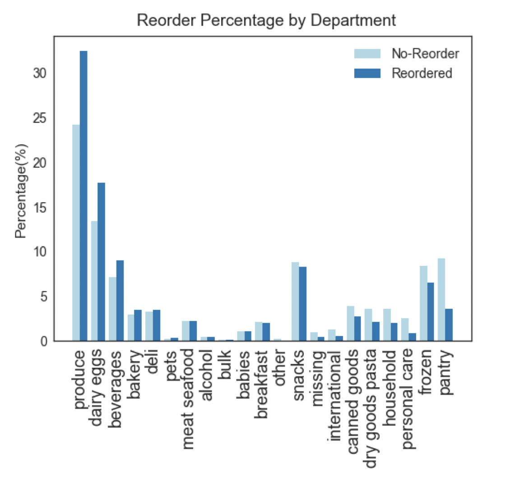
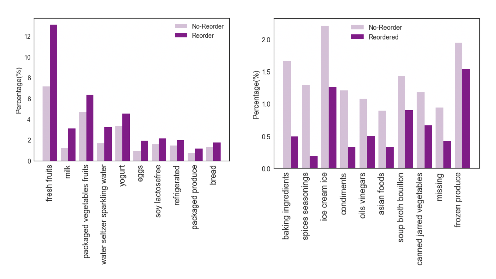

This is a project adpated from the [Instacart Market Basket Analysis Competition from Kaggle](https://www.kaggle.com/c/instacart-market-basket-analysis).   

### Scope

The original Kaggle competition asked to predcit what product a customer would purchase in the next order, given the order history info. The problem was modified to predict whether he would reorder anuy products he had ordered in the past.

### Data
The data can be downloaded from [Kaggle](https://www.kaggle.com/c/instacart-market-basket-analysis/data) directly. I used AWS t2.2xlarge instance when working with the entire dataset.    

### Features
The features I engineered can be grouped into the following 4 main categories:
- User Features  
- Product Features
- User-Product Features
- Current Order Specific Features

You can find the feature details at my [Github repo](https://github.com/caiy7/Project_Mcnulty/blob/master/README.md). 

### Model Selection
Model Selection was performed on a subset of data (~6.3% of the total data) on laptop locally. 

To evaluate the model, I chose F1 score as the metrics. I would like to catch the correct products as many as I can, but at the same time, I don't want to overwhelm the users by recommending products they are not interested in. F1 score provides the balance on the trade off between recall and precision.  

A comparison among Logistic Regression, Random Forest and Gradient Boosting showed that Gradient Boosting performed slightly better. When using Logistic Regression, all categorical features were converted to dummie variables. Polynomial features, log tranformed features and different strength of regularization were also tested under Logistic Regression.  

After tuning, the average f1 score on 5-fold cross validation was 0.437 with average adjusted probability threshold at 0.2114. 

### Final Model and Testing
 Then I moved to AWS EC2 to train the final model and tested on a holdout set with 20,000 orders. The test f1 score was 0.436. 

### Discussion
#### Feature Engineering
The raw dataset comes with very limited number of features to work with. Creating new features with predictive power makes the difference between success and failure here. Although tree based models can automatically take care of feature interactions, features with summary statistics may help improve the model accuarcy. 

To deal with the categorial features like the department and aisle info, I used something similar to target encoding or bin counting in this project. I caculated the probablies of reorder and no reorder accross the department or aisles and binned the diffference in the probabilities between reorder and no reorder in each category. The advantage of this technique over one hot encoder is that it avoids creating additional features for each category and summarizes target statistics. Since I used only prior order info to create these features, I don't need to worry about data leaky due to the data separation.

#### Feature importance  
 To see what features contributed most to the model, I plotted the featuren importance in term of gain. Not surprisingly, the user-product specific features were the most important ones.   
 In fact, the first top 3 features contributed great predictive power. A scatter plot of feature on when was the last order the customer purchased the product and the feature on percentage of the orders containing the product showed some pattern of the targets. The histgram on average days between the orders containing the product also showed that the longer gap between orders, the less likely the user would re-order. 
<iframe src="https://public.tableau.com/views/mcnulty_features/Dashboard2?:showVizHome=no&:embed=true" width="800" height="955"></iframe>

#### Product type 
 Plot of reordering percentage of products by department or aisle revealed that product type matters. Products that don't last long or people consume on a daily or weekly basis have a higher reorder percentage, for example, fresh fruit and milk. Products that people can stock up on or products that people use only once in a while have lower reorder percentage.  
 
 

### Next Steps
For the current model, aggregated features were weighted evenly across time. Static time features like gaps between order or days since last purchase were added seprately. Incorporating time series features or time weighted features, for example, order counts with exponential deday over time might improve the performance. 

Thank you for reading my post.

  
