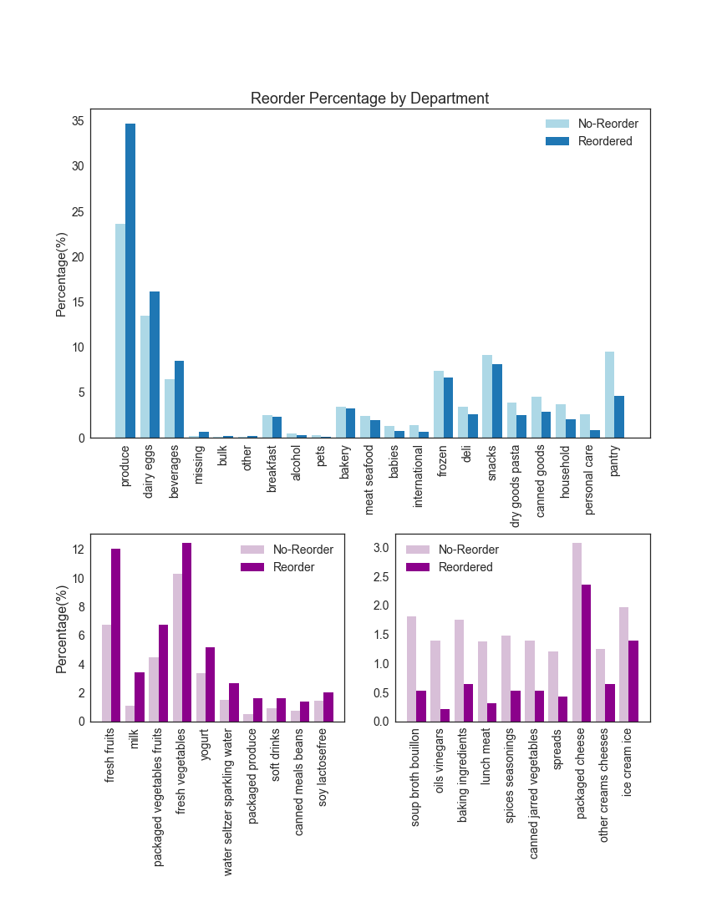

This is a project adpated from the [Instacart Market Basket Analysis Competition from Kaggle](https://www.kaggle.com/c/instacart-market-basket-analysis).   

### Scope

The original Kaggle competition asked to predcit what customer would purchase in his next order, given the order history info. We  modified it by predicting whether he would reorder the products he had ordered in the past.

### Data
The data can be downloaded from [Kaggle](https://www.kaggle.com/c/instacart-market-basket-analysis/data) directly. Here's a simple diagram on the tables in SQL format. I use AWS when working with the entire dataset. The t2.2xlarge instance worked ok most of hte time, except that for some merges, I had to delete some variables to free up the RAM. Pandas was used for data cleaning, feature engineering and training the model.    

### Features
The features I engineered can be grouped into the following 4 main categories:
- User Features  
- Product Features
- User-Product Features
- Current Order Specific Features

You can find the feature details at my [Github repo](https://github.com/caiy7/Project_Mcnulty/blob/master/README.md). 

### Model Selection
Model Selection was performed on a subset of data (~2.5% of the total data) on laptop locally. 

To evaluate the model, I chose F1 score as the metrics. I would like to catch the correct products as many as I can, but at the same time, I don't want to overwhelm the users by recommending products they are not interested in. F1 score provides the balance on the trade off between recall and precision.  

I tried Logistic Regression, Random Forest and Gradient Boosting. Gradient Boosting gave slightly better result. When using Logistic Regression, all categorical features were converted to dummie variables. Polynomial features, log tranformed features and different strength of regularization were also tested under Logistic Regression.  

After tuning, the average f1 score on 5-fold cross validation was 0.429 with average adjusted probability threshold at 0.2138. 

### Final Model and Testing
 Then I moved to AWS to train the final model and tested on a holdout set with 15% of the whole data. 
 The test f1 score was 0.401, lower than my expectation. It didn't seem like the model overfitted, as the AUC scores were the same. I plotted f1 score over the probability threshold. And it seems that the probability for the optimal f1 shifted, which caused decrease on the f1 score of the final test. This is probably because the subset data size is not large enough.   
  

 ### Discussion

 #### Feature importance  
 To see what features contributed most to the model, I plotted the featuren importance in term of gain. Not surprisingly, the user-product specific features were the most important ones.   
 In fact, the first top 3 features contributed great predictive power. A scatter plot of feature on when was the last order the customer purchased the product and the feature on percentage of the orders containing the product showed some pattern of the targets. The histgram on average days between the orders containing the product also showed that with the longer gap between orders, the less likely the user would re-order. 
<iframe src="https://public.tableau.com/views/mcnulty_features/Dashboard2?:embed=y&:display_count=yes" width="800" height="955"></iframe>

 #### Product type 
 Plot of reordering percentage of products by department or aisle revealed that product type matters. Products that don't last long or people consume on a daily or weekly basis have a higher reorder percentage, for example, fresh fruit and milk. Products that people can stock up on or products that people use only once in a while have lower reorder percentage.  
 

### Next Steps
For the current model, aggregated features were weighted evenly across time. Static time features like gaps between order or days since last purchase were added seprately. Incorporating time series features or time weighted features, for example, order counts with exponential deday over time might improve the performance. And I will definitely work with a larger dataset when selecting and tuning models in the future. 

Also I think it will make the project more complete if I could implement an interactive system using flask and D3. That's something I will work on as well.

Thank you for reading my post.

  
