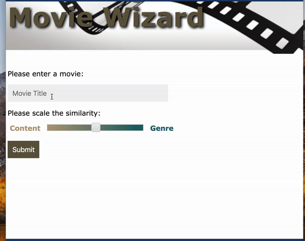

Many of the recommendation systems we see today are based on the collaborative filtering approach, which makes recommendations based on the similarity in user tastes. The advantage of collaborative filtering is that it doesn't need content information. It "automatically" discovers the elements for recommendation based on users' behavior, like ratings or click-through rate. But the disadvantage of collaborative filtering is that it doesn't cope with new product as there's no data to start with. This is commonly called a cold start problem. In this case, content based movie recommendation could be a complement. 

Content based recommendation system, self-explanatory by its name, is to provide recommendation based on the similarity in its content, which can be anything descriptive about the item. In this post, I will describe a movie recommendation system I built based on movie scripts and genre. Code available at my [Github Repo](https://github.com/caiy7/Project_Fletcher).  

### Get the data ready
For movie content analysis, I decided to use movie script and I downloaded >1,000 movie scripts from [IMSDB](https://www.imsdb.com/).   

Movie scripts are very structured text. However, the heterogenous source of the scripts that IMSDB has curated made the text process more difficult than I had expected. Some of the scripts contain various scripts specific terms, specifying whether the scene is exterior or interior or how the camera goes. All those terms need to be removed from the text as they don't contribute to movie content. Lucky that those terms are limited and they can be include in the stop words or removed when preprocessing the raw text.   

Another problems are the character names in the scripts. When reoccurring names were not removed from the text before topic modeling, it formed topics based on the character names. My homebrew approach to the problem is to add the high frequency, NNP(Proper Noun)  tokens to stop words. This is based on the rationale that the main character names are usually tagged as NNP and show up frequently in the script. By adding them to stop words, I can also remove those names in the other scripts with lower frequency. This method was not perfect but worked well for the model. 

#### NER from spaCy
I also noticed that there are [Named-entity Recognition (NER)](https://en.wikipedia.org/wiki/Named-entity_recognition) tools available and I thought I could use it to remove character names directly from the scripts. I tried NER tool from [spaCy](https://spacy.io/usage/spacy-101#annotations-ner).  

The NER from spaCy is powerful. It recognizes and categorizes quite a few different types of named entities (for [details](https://spacy.io/api/annotation#named-entities)). But I notice that the prediction of the NER model strongly depends on the structure and format of the token, for example, removing the period from the previous sentence or uncapitalize a word changes the result. And movies scripts are very different the Wikipedia document - the corpus used to train the model. Movie scripts contain lots of incomplete sencentens and capitalize words, which decreases the accuarcy. Based on the result, I decided to move forward with my homebrew method.

### TF-IDF Transformation
To transform text into features that we can work with, I chose TF-IDF transformation. The general idea  of this transformation first get the vectorize each word in the text with its frequency (term frequency for tf) and then normalize it by the inverse of documnet-frequency - log of the inverse fraction of document that contains the word. It can be explained as the surprise of seeing the word in the document. This makes sense as the more specific information is more useful in describing a project. The default tf-idf implementation in scikit-learn is shown below. 1 is added to the numerator and denominator to avoid division by zero. 1 is added to the whole idf term to avoid getting 0 idf when a word occurs in all documents in the training corpus. 

$$tf_t\log(\frac{1 + N}{1 + n_t} + 1 )$$

Tf-idf uses parameter `max_df` and `min_df` to set the range of document-frequency when building the vocabulary. I choses `max_df=0.7` to ignore totally words that occure in more than 70% of the scripts instead of just weight them down by idf. To avoid some rare words or words that specific to movie sequels, I set `min_df=20`. 

### Topic Modeling

Non-negative matrix factorization (NMF) is one of the matrix decomposition algorithms. Unlike singluar value decomposition (SVD), all the elements in the matrices are non-negative, which makes the result easier to interpret.

By using NMF, I was able to get 32 'topics' with distinct content. The table below lists a few of them and the representative words associated with each topic. 
    

When I saw the "Film/Play" topic with words like film, movie, camera, I was worried that I failed to remove the script specific term from some of the scripts. A close look at the data discovered that movies with high value in this topic are movies about movies like The Artist, Cinema Paradiso and etc. And that cleared the concerns.  

To visualize the topic modeling result, I reduced the topics to 2 dimention using t-SNE and plotted all the movies. And each movie was color by its top topic. Most of the movies assigned the same topics are close to each other. Interestingly, the 4 movies from the Indiana Jones sequel are assigned to 4 different topics, but they are still close to each other. This is because the 4 movies contain similar topics, but each movie may emphasize on a different topic according to the theme. So I think it is more appropriate to consider those topics as elements of the movie.
 

### Recommandation
To set up a content based movie recommendation engine, one approadh is to calculate the cosine similarity, or euclidean distance between movies. As the movie elements alone don't seem to catch the genre information very well, particularly animation, which is hard to tell by reading the script. 
To fix this, I combined the normalized topic vector with the vector of genres for each movie and then calculate the euclidean distance. The genre vector was also transformed by tf-idf. In this way, less frequent genre like Biography can be more distant from the more common genre like Drama. 

A web app was built through Flask:

As an alternative to using movie title as the input, plot text and genre can also be used as the input. As an example, I took the plot summary from How to Train Your Dragon: The Hidden World from Wikipedia (which is not in the trainning set) as the input and selected Animation as genre. The app was able to recommend the other 2 movies in the sequel and some other similar movies. Hooray!

### Future Improvements
One limitation of this recommendation engine is that the number of movies in the training set is relatively small and it can only recommend movies from the training set. A larger movie data set would improve the topic modeling and the provide better recommendation.  

Movie attributes like directors or casts can also be used as factors for content based recommendation. Those addition features (eg, information available at IMDB) would be helpful to improve the recommendation result.  

Content based recommendation can be used as a solution to the cold start problem. A hybrid recommendation system combining both content based recommendation and collaborative filtering could work better! I will write a separate post on collaborative fitering using Alternating Least Square.

