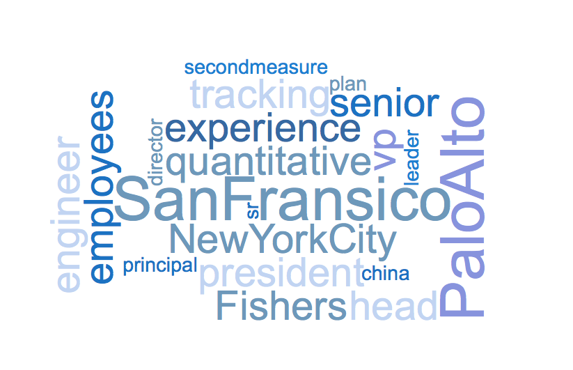

When I saw the estimated salaries feature on the job post from Glassdoor, I though it would cool if I could do something simiar: to build a model to predict salaries and to gain insights on the factors that impact salaries. And I did it.

### DATA
Around 1900 job posts from around 900 companies from [AngelList](https://angel.co) were scaped using Selinium and BeutifulSoup. 

After clean up, I had a final data set of 1601 records. Some of the features are listed below: 
- **numeric features:**   
minimal experience requirement, number of currently employees, number of job openings in the company and etc.
- **categorical features:**   
visa support, 401k, minimal degree requirement and etc.
- **text features:**  
title, job description, skills requirement, company product info and etc.

The text features needs further process before they can be incorporated in the model. 

### MODEL SELECTION
Pairplot on the numeric features didn't show any obvious correlation between the target and the features. To start with, I built a simple linear regression model using all the numeric features and the categorical features as the baseline. The features included 401k, minimal experience requirement, insurance, stocked kitchen, visa, employee number, investor number, job opening number, minimal degree requirement, company size, equity, job types(full time, intern and etc.) 

15% of the data were set aside as holdout set and  cross validation with cv=5 was performed on the rest of the data. 

The baseline model gave an R2 of 0.20 and RMSE of $34,882.80, which was far from ideal. The distribution of residuals are roughly symmetrical, implying that adding polynomial terms might not improve the model significantly.
  

I also tried log transformation of features and adding interactions, but the model was not improved. 

Intuitively, location of the job should have some predictive power. Expensive cities tend to offer higher salaries to attract candidates. As location is a categorical feature with high cardinality, I added regularization to the model in order to avoid overfitting. The R2 of the model was then improved to around 0.36 after adding location to the model. This was encouraging.

To process the pure text features, I used the feature extraction tool - CountVectorizer from scikit-learn. It converts a collection of documents into vectors of word counts, which can be used as features in the regression model. Adding those text features did improved the model significantly.   

### RESULT
In my final model, the R2 was about 3 fold of the baseline model and the RMSE decrease by more than 10k. 

**Model hyperparameters:**
- Lasso
- lambda = 660
- maxfeature = 1000 (CountVectorizer)  

**Test score on holdout test**  
- R2 = 0.64  
- RMSE = $24,1690.12  
The total input feature number was 4284. After regularization, only 549 features remained.

Here are the top 10 postive and negative coefficients. 

Top 10 Positvie coefficients:  

| Feature* | Feature Type | Coef |  
| :--- | :--- | :--- |  
| San Francisco | Location | 7,929.03 |  
| Palo Alto | Location | 4,483.74 |  
| New York City | Location | 3,550.30 |  
| Senior | Title | 3,507.37 |  
| Experience | Numerical Feature | 3,355.35 |  
| President | Title | 2,829.67 |  
| Head | Title | 2,549.40 |  
| VP | Title | 2,512.25 |  
| Employees | Numerical Feature | 2,421.05 |  
| China | Company Tags | 2,365.01 | 

Top 10 negative coefficients:  

| Feature* | Type | Coef |  
| :--- | :--- | :--- |  
| Berlin | Location | -3,459.27 |  
| Internship | Job Type | -3,415.45 |  
| Intern | Title | -3,305.03 |  
| Paris | Location | -3,020,05 |  
| 1-10| Company Size | -2,677.14 |  
| Analyst | Title | -2,238.74 |  
| London | Location | -2,183.23 |  
| Bengaluru | Location | -2,006.16 |  
| Equity Higher Bound | Numeric Feature | -1,978.28 |  
| Bangkok | Location | -1,978.28 |    

*All features were scaled. 

### Thoughts
Though R2 at 0.64 was not ideal for a prediction model, the model has improved significately by addting all the text features.  
#### What impacts salary
A peek on the top positive and negative coeffients shows that **location** plays an important role. Large cities in US such as NYC, SF, and Palo Alto (also in Bay Area) have high positive coefficients, implying that jobs in those cities tend to offer higher salaries. To my surprise, jobs in large European cities such as Berlin, London, Paris pay less according to the model. After double checking on currency conversion and some google search, I figured out that European countries in general pay lower in net salaries, but offer better social benefits, such as low education cost and low healthcare cost. 

**Title** is also an important predictor for salaries. Words like senior or words indicating management level position such as president, VP have positive impact on salaries, while having "inten" in the title usually indicates a lower salary.

We can see that other factors like work experience, company size, affect salaries as well. 

### Next Steps
To further improve the model, here're a few things I would like to try in the future.   
1. Include more data to train the model
2. Look up a few examples to understand where the prediction errors are from and try to improve the model based on this knowledge
3. It is likely there are nonlinear relationship between the features and the target. Try Nonlinear models, like random forest to see if they perform better.  
4. Depending on the application, information like the equity offered with the job may or may not available for the prediction model. May want to remove it from the model.

The codes and data are availabe at my [Github Repo](https://github.com/caiy7/Project_Luther). Thank you for reading and I hope it sounds like an interesting project to you.   

(Word cloud made from top positive coefficients)

