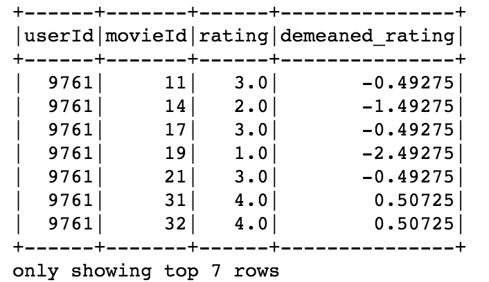
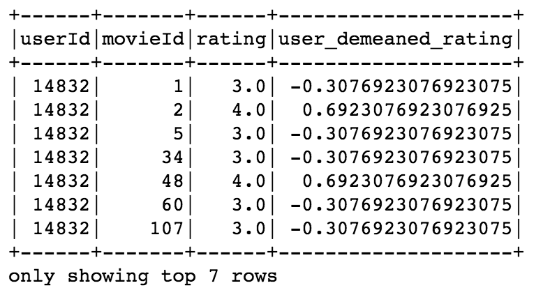

I came across pyspark Pandas UDF when I was trying to rewrite my python code for pyspark for scaling purpose. I would like to perform a train test split within each user group, but there's no easy way to do that in pyspark due to the way the groups, rows and columns are presented in spark. Luckily, Pandas UDF came to my rescue. I found it a very powerful tool and I'd like to share it in this post. 

### Introduction
Pandas UDF was a new funtion introduced in version 2.3 and it is still "Experimental" according to the API documentation. It is built on top of Apache Arrow and it creates vectorized user definded function (UDF).
### Why Pandas UDF?
PySpark has an existing UDF which was introduced in version 1.3, so why use Pandas UDF? Compared to the existing UDF, Pandas UDF has the following advantages:  
1. **Better Performance**  
The existing UDF operates one-row-at-a-time, while Pandas UDF takes advantage of vectorization. 
2. **Ressemblance of Pandas DataFrame**  
Unlike the existing UDF which takes a python object, Pandas UDF can take `pandas.Series` or `pandas.DataFrame` and input and return a `pandas.Series` or `pandas.DataFrame`. This allows you to code like you were working with a pandas dataframe and you don't have to worry about how to operate Spark Row and Column objects. 


Let's walk through a few examples to see how it works:  
First make sure that pyspark works properly and pyarrow is installed. To install pyarrow, you can either use conda:
```bash
conda install -c conda-forge pyarrow
``` 
or pip:
```bash
pip install pyarrow
```

There are two types of Pandas UDF functions: **Scalar** and **Grouped Map**. (Spark 2.4.0 introduced a third type: **Grouped Aggregate** which returns aggregated result. You can check the [documentation](https://spark.apache.org/docs/latest/sql-pyspark-pandas-with-arrow.html#grouped-aggregate) for more information.)

#### Scalar

Scalar Pandas UDF works on columns. When you define the python function, the input should be a `pandas.Series` and the output is a `pandas.Series` with the same length.   

To use it with spark Dataframe, we use `pandas_udf` as the function decorator. The decorator takes two arguments: the `returnType` and the `functionType`.

In this example, I have a spark dataframe `df` of movie ratings and I want to demean the ratings. The data type of the demeaned rating should be `double` and the `functionType` should be `PandasUDFType.SCALAR` since we are using the scalar Pandas UDF. Here's how we define the function:
```python
@pandas_udf('double', PandasUDFType.SCALAR)
def demean(rating):
    return rating - rating.mean()
```
We can use the Pandas UDF `demean` with `withColumn` to add a new column of `demeaned_rating`:
```python
df_demean = df.withColumn('demeaned_rating', demean('rating'))
```
And here's the result:


#### Grouped Map 
You might not be convinced about the power of Pandas UDF yet, but the grouped map may change your mind.  

Grouped Map Pandas UDF uses the same `pandas_udf` decorator, but in the `returnType` you need to pass a schema of the output dataframe and set the `fucntionType` to `PandasUDFType.GROUPED_MAP`. The dataframe schema could be a `pyspark.sql.types.StructType` or simply a string that specifies the column names and data type, separated by commas.   

The input and output of the python function under the decorators should be grouped `pandas.DataFrame`. When we use it in combination with `groupBy` and `apply`, it works very similar as the split-apply-combine that we are familiar with.  

Let's look at an example. This time I would like to demean the movie ratings within each user. First, define the output dataframe schma. Note that we need include the new demeaned column and its type.  
```python
demean_schema = 'userId int, movieId int, rating double, user_demeaned_rating double'
```
Define the function:
```python
@pandas_udf(demean_schema, PandasUDFType.GROUPED_MAP)
def demean_user(df): 
    df['user_demeaned_rating'] = df['rating'] - df['rating'].mean()
    return df
```
Apply the function with `groupBy`:
```python
df_user_demean = df.groupBy('userId').apply(demean_user)
```
Here's the result:


#### More Grouped Map Example

If you are still not impressed, let's take a look at an example with a more complex function. In this example, I would like to make a holdout set from the rating data. I'd like to randomly choose half of users and if the chosen user has more than 25 ratings, I will randomly take 10 ratings to the holdout set. To aid the data split, I will first create a new column `istest` which labels whether the data belongs to holdout set. 

Here's the code:
```python
istest_schema = 'userId int, movieId int, rating double, istest int'
TEST_MOVIES=10

#define pands udf
@pandas_udf(istest_schema, PandasUDFType.GROUPED_MAP)
def istest(df):  
    # assign a random number and only pick ratings if it is > 0.5
    is_test_user = np.random.random()  
    new_test = np.zeros(len(df))
    if is_test_user > 0.5 and len(df)> 25:      
        test_ind = np.random.choice(np.arange(len(df)), TEST_MOVIES, replace=False)
        # change chosen ratings label to 1
        new_test[test_ind]=1
    # add 'istest' column to the df
    df['istest'] = new_test
    return df

# apply pandas udf
df_with_ind = df.groupBy('userId').apply(istest)

# split dataset according to the 'istest' column
train = df_with_ind.filter('istest=0')
test = df_with_ind.filter('istest=1')
```
Note that inside the function, the code is written in the same way as if you write a function that works with a pandas dataframe. 

All the codes are avaialbe at my [Github Repo](https://github.com/caiy7/notes/blob/master/pyspark/Pandas_Udf_Examples.ipynb). I hope you find this post helpful!

#### Reference
[Introducing Pandas UDF for PySpark - How to run your native Python code with PySpark, fast. By Li Jin](https://databricks.com/blog/2017/10/30/introducing-vectorized-udfs-for-pyspark.html)

