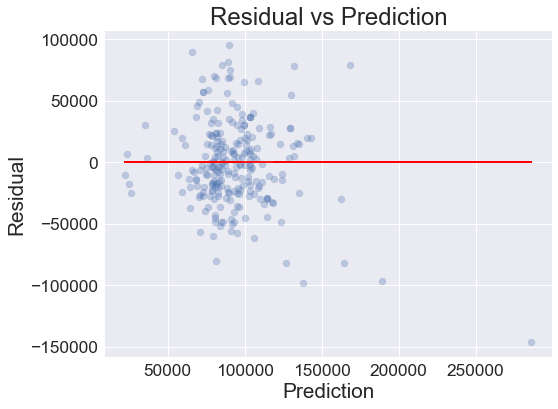
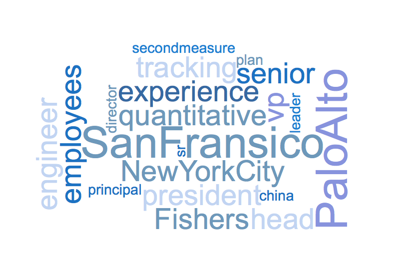

It's the 3rd week at Metis and my second project (code "Luther") - build linear regression model on information obtained from webpages. I though it would cool if I cool if I could build a model to predict salaries from the information about the job and the company, since i will be in the market two and a half months later. 

### SCOPE
Predicting salaries of jobs posted, focusing small-mid size start-up company. 

### DATA
I scraped around 1900 job posts from around 900 companies from [Angel List](https://angel.co) using Selinium and BeutifulSoup. 

After removing outliers or records that were out of scope of this project, eg. jobs from companies with over>500 people, I had a final data set of 1601 records. Each record has numeric features like requirement in minimal experience, number of currently employees, number of job openings in the company; a few simple categorical features, such as visa support, 401k, minimal degree requirement and etc. In addition to that, I also have some features in pure text, which will need NLP prepross before incorport them in the model. 

### MODEL SELECTION
Pairplot on the numeric feature didn't show apparent correlation between the target and any of the numberic feature. Thus I decided to build a simple linear regression model on all the numeric features and the simple categorical features as the baseline. There features included 401k, minimal experience requirement, insurance, stocked kitchen, visa, employee number, investor number, job opening number, minimal degree requirement, company size, equity, job types(Full time, intern and etc.) 

I took out 15% of the records as holdout set and all the following models were reported via cross validation with cv=5. 

The initial model gave an R2 of 0.20 and RMSE of $34,882.80, which is far from ideal. The distribution of residual were approximately symmetrical, indicating that adding polynomial might not help.   
  

Then I tried log transform of the numerical features which showed a little improvement. And adding interaction between the features didn't help at all.

Regularization of the above models didn't improve the R2, indicating that there's more bias in the model than variance. 

I decided to incorporate the rest features sequencially to the model. 

Intuitively, location of the should have some predictive power. Expensive cities usually offer higher salar. This added around more features to the model. After regularization, the R2 of the model improved to around 0.36. 

This was encouraging. I decided to incorporate features like skill requirement, job title, job descripton and ect. As the values in those features didn't fall into a few categories, I used the CountVectorizer tool from scikit-learn to transform the text information into matrices of counts of words for the linear regression model. 

I added job skill requirement, job skill requirement, job title, job description, company segmentation and company product information sequencentially. Incorporating those features inceased the R2 of my model gradually. And in all the cross validation test, Lasso perfermed better than Ridge in terms of R2.

### RESULT
#### Final Model
I used following parameter for my final model:
- Lasso
- \lambda = 660
- maxfeature = 1000 (CountVecterizer)  

**Test score on holdout test**  
R2 = 0.64  
RMSE = $24,1690.12  
The total input feature number was 4284. After regularization, only 549 features remained.

Here are the top 10 postive and negative coefficients.  
Top 10 Positvie coefficients:
|Feature*|Feature Type|Coef|
|:---|:---|:---|
|San Francisco|Location|7,929.03|
|Palo Alto|Location|4,483.74|
|New York City|Location|3,550.30|
|Senior|Title|3,507.37|
|Experience|Numerical Feature|3,355.35|
|President|Title|2,829.67|
|Head|Title|2,549.40|
|VP|Title|2,512.25|
|Employees|Numerical Feature|2,421.05|
|China|Company Tags|2,365.01|  
Top 10 negative coefficients:
|Feature*|Type|Coef|
|:--|:---|:---|
|Berlin|Location|-3,459.27|
|Internship|Job Type|-3,415.45|
|Intern|Title|-3,305.03|
|Paris|Location|-3,020,05|
|1-10|Company Size|-2,677.14|
|Analyst|Title|-2,238.74|
|London|Location|-2,183.23|
|Bengaluru|Location|-2,006.16|
|Equity Higher Bound|Numeric Feature|-1,978.28|
|Bangkok|Location|-19.78.28|

*All the feature were scaled. 

### Thoughts
Though R2 at 0.64 was not good for a prediction model, the model has improved significately by addting all the text features. 
A peek on the top positive and negative coeffients shows that jobs from large cities in US such as NYC, SF, and Palo Alto (also in Bay Area) tend to offer higher salaries. Senior or management position are also associate with higher salaries, while intern positiions usually don't pay well. These all agree with our common sense which incidates the model somehow makes sense.   
Interestingly, the model showed that European cities tend to offer lower salaries as well. I was surprised to see that and double checked to see if I converted the currency correctly. With the explaination by Vinny (our instructor) and some google search, it seems that this result is also valid. European country usually provide better benefits (low education cost, low healthcare cost), but lower in the net salaries.

### Next Steps
To further improve the model, here're a few things I can do in the future.   
1. Include more data to train the model
2. Try TfidefVectorizer, building matrices on word frequency instead of counts to give more weigths to those words with lower occurrence but have higher predictive power.
3. Look up a few examples to understand where the prediction errors are from and improve the model based on this knowledge
4. It is likely that the relation between the target and feature are not linear. Try Nonlinear models, like random forest to see if they perform better.  
5. Depending on the application, information like the equity offered with the job may or  not available for the predictino model. May want to remove it from the model

The code and data are availabe at my [github](https://github.com/caiy7/Project_Luther). Thank you for reading and I hope it sounds like an interesting project to you.   
I so look forward to starting my next project at Metis. 

(World cloud made from top positive coefficients)

